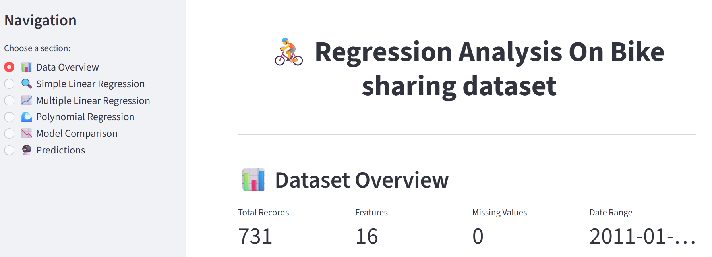
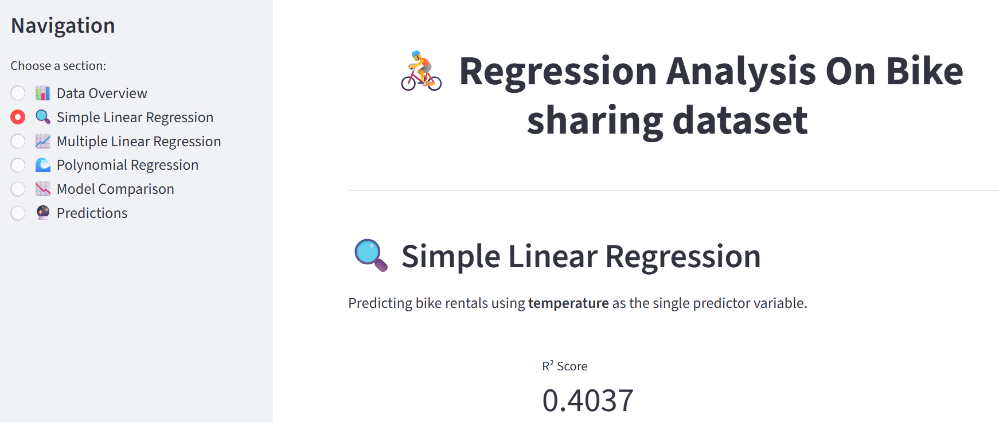

# Regression Models Comparison: Linear, Multiple Linear & Polynomial

A comprehensive machine learning project that implements and compares three different regression models to predict bike rental counts using the Bike Sharing Dataset and sklearn library. This project demonstrates the application of Simple Linear Regression, Multiple Linear Regression, and Polynomial (Non-Linear) Regression techniques.

## 📋 Summary

This project explores the relationship between weather conditions, temporal features, and bike rental demand by implementing three regression models:

- **Simple Linear Regression**: Predicts bike rentals using temperature as a single predictor
- **Multiple Linear Regression**: Extends the model with multiple features (temperature, humidity, windspeed, and other weather/temporal variables)
- **Polynomial Regression**: Implements non-linear regression using polynomial features (temperature²)

The project includes comprehensive data preprocessing, feature scaling, model training, evaluation metrics (R², MSE), residual analysis, and visualizations to compare model performance.

## 👤 Author

[https://www.linkedin.com/in/vineetkrsrivastava/]

📧 Email: [mailto:communication.vineet@gmail.com] - Feel free to reach out for queries!

## ✨ Key Features

- **Data Preprocessing**: Missing value analysis, feature scaling using StandardScaler
- **Simple Linear Regression**: Single-feature model with temperature as predictor
- **Multiple Linear Regression**: Multi-feature model with weather and temporal variables
- **Polynomial Regression**: Non-linear model with quadratic temperature features
- **Model Evaluation**: R-squared (R²) and Mean Squared Error (MSE) metrics
- **Visualization**: Scatter plots, regression lines, residual plots, and model comparison charts
- **Comprehensive Analysis**: Detailed comparison of all three regression approaches
- **Interactive Web App**: Streamlit application for interactive model exploration and predictions

## 📈 Summary of Results

This project implemented and compared three regression models to predict bike rental counts (`cnt`) from the bike-sharing dataset:

### Model Performance Summary:

| Model | R-Squared (R²) | Interpretation |
|-------|---------------|----------------|
| **Simple Linear Regression** | 0.4037 (40.37%) | Temperature alone explains ~40% of variance in rental counts |
| **Multiple Linear Regression** | 0.4995 (49.95%) | Multiple features (temp, atemp, hum, windspeed, season, etc.) explain ~50% of variance |
| **Non-Linear Regression (Polynomial)** | 0.3936 (39.36%) | Quadratic term (temp²) with temp explains ~39% of variance |

### Key Findings:

1. **Best Performing Model**: Multiple Linear Regression achieved the highest R² of **0.4995**, indicating it explains approximately **50% of the variance** in bike rental counts.

2. **Feature Importance**: The inclusion of multiple features (weather conditions, seasonal factors, and temporal variables) significantly improved model performance compared to using only temperature.

3. **Linear vs. Non-Linear**: The polynomial regression model performed slightly worse than simple linear regression, suggesting that the relationship between temperature and rental counts is **primarily linear** rather than quadratic for this dataset.

4. **Residual Analysis**: The residuals plots show random scatter around zero, indicating that the models are not systematically biased, though there is still substantial unexplained variance.

### Important Takeaways:

1. **Multiple Features Outperform Single Features**
   - Adding more relevant features (weather, season, time-based) improved model performance by **~10 percentage points** compared to simple linear regression.
   - This demonstrates the value of feature engineering and including domain knowledge in model development.

2. **Model Complexity Doesn't Always Guarantee Better Performance**
   - The polynomial regression model (more complex) did not outperform the simpler linear models.
   - This highlights the importance of model selection and avoiding unnecessary complexity (Occam's Razor principle).

3. **Substantial Room for Improvement**
   - Even the best model (Multiple Linear Regression) only explains **~50% of the variance**.
   - This suggests there are other factors which may be influencing bike rentals.

4. **Practical Learning**
   - Successfully learned how to implement and compare simple, multiple, and polynomial (non-linear) regression models.

## 📊 Dataset

The project uses the **Bike Sharing Dataset** (`day.csv`) containing:
- **731 records** with **16 features**
- Features include: temperature, humidity, windspeed, season, weather conditions, holidays, and temporal variables
- Target variable: `cnt` (total bike rental count)

## 📸 Application Screenshots

Here are some snapshots of the interactive Streamlit application:

### Dataset Overview


### Simple Linear Regression


## 🚀 Setup and Installation

### Prerequisites

Make sure you have Python 3.7+ installed on your system.

### Step 1: Clone the Repository

```bash
git clone https://github.com/your-username/regression-comparison-linear-multiple-polynomial.git
cd regression-comparison-linear-multiple-polynomial
```

### Step 2: Install Required Packages

Install the required Python packages using pip:

```bash
pip install pandas numpy matplotlib seaborn scikit-learn jupyter
```

Or use the requirements file:

```bash
pip install -r requirements.txt
```

### Step 3: Dataset Setup

Ensure the dataset is in the correct location:
- The `bike+sharing+dataset/` folder should be in the same directory as the notebook
- The folder should contain `day.csv` file

## 💻 How to Use

### Running the Notebook

1. **Start Jupyter Notebook**:
   ```bash
   jupyter notebook
   ```

2. **Open the Project Notebook**:
   - Navigate to `module2Project.ipynb`
   - Open it in Jupyter Notebook or JupyterLab

3. **Execute Cells**:
   - Run cells sequentially (Shift + Enter) or run all cells
   - The notebook is organized into sections:
     - Data Loading and Exploration
     - Data Preprocessing
     - Simple Linear Regression
     - Multiple Linear Regression
     - Polynomial Regression
     - Model Comparison and Summary

### Running the Streamlit App

1. **Install Streamlit** (if not already installed):
   ```bash
   pip install streamlit
   ```
   Or install all dependencies:
   ```bash
   pip install -r requirements.txt
   ```

2. **Run the Streamlit app**:
   ```bash
   streamlit run streamlit_app.py
   ```

3. **Access the app**:
   - The app will automatically open in your default web browser
   - If not, navigate to `http://localhost:8501`

The Streamlit app provides an interactive interface to:
- 📊 Explore the dataset
- 🔍 View Simple Linear Regression results
- 📈 Analyze Multiple Linear Regression performance
- 🌊 Examine Polynomial Regression curves
- 📉 Compare all three models side-by-side
- 🔮 Make interactive predictions with custom inputs

### Project Structure

```
regression-comparison-linear-multiple-polynomial/
│
├── module2Project.ipynb          # Main project notebook
├── streamlit_app.py              # Interactive Streamlit web application
├── bike+sharing+dataset/          # Dataset folder
│   ├── day.csv                   # Main dataset file
│   ├── hour.csv                  # Hourly data (optional)
│   └── Readme.txt                # Dataset information
├── requirements.txt              # Python dependencies
└── README.md                     # This file
```

## 🔧 Technologies Used

- **Python 3.7+**
- **Pandas**: Data manipulation and analysis
- **NumPy**: Numerical computations
- **Matplotlib & Seaborn**: Data visualization
- **Scikit-learn**: Machine learning models and metrics
- **Jupyter Notebook**: Interactive development environment
- **Streamlit**: Interactive web application framework

## 📝 Project Sections

1. **Data Loading & Exploration**: Dataset overview, shape, and basic statistics
2. **Data Preprocessing**: Missing value analysis, feature scaling
3. **Simple Linear Regression**: Single-feature model implementation
4. **Multiple Linear Regression**: Multi-feature model with feature engineering
5. **Polynomial Regression**: Non-linear regression with polynomial features
6. **Model Comparison**: Performance metrics and visualizations
7. **Conclusion**: Summary of findings and insights

## 🤝 Contributing

This is an educational project, but suggestions and improvements are welcome! Feel free to:
- Open issues for bugs or suggestions
- Submit pull requests for enhancements
- Share your own regression model implementations

## 📄 License

This project is open source and available for educational purposes.

## 🙏 Acknowledgments

- Dataset: Bike Sharing Dataset (UCI Machine Learning Repository)
- IIT Delhi AI/ML Program for project framework

---

⭐ If you find this project helpful, please consider giving it a star!
